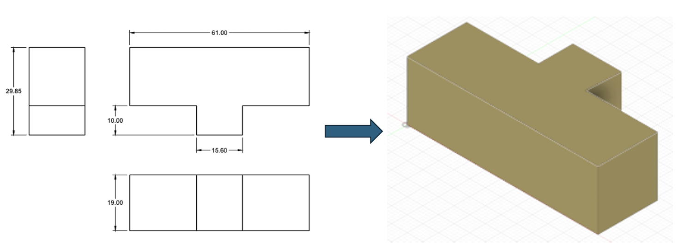
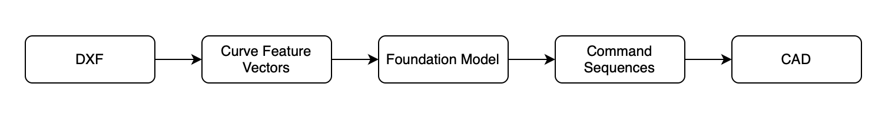
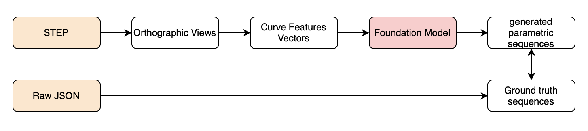
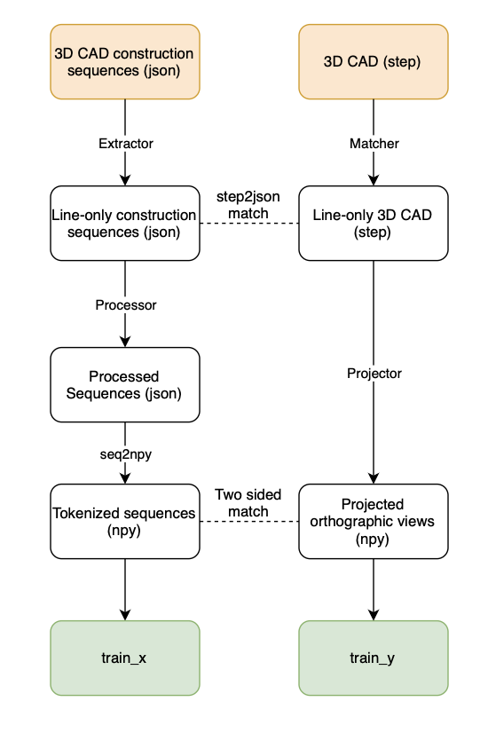

# DXF2CAD 
An AI-powered end-to-end pipeline for converting 2D blueprints in DXF format to 3D CAD models in STEP format using parametric sequence modeling. 

An example of DXF to CAD where I input a DXF file and the pipeline outputs a STEP file:

The inference flowmap:

The training and data preparation flowmap:

Due to limited data—especially the scarcity of corresponding blueprint and 3D CAD file pairs—we convert STEP files into orthographic views and encode these views as vectors for training. During inference, we then extract entities from DXF files and encode them into vector representations using the same process.

## Contributions: 
  - A novel **end-to-end pipeline** for converting 2D blueprints in DXF format to 3D CAD in STEP format, including DXF entity extraction, a foundation model that transforms orthographic views into CAD parametric sequences, and a CAD rendering script. 
  - A **paired up dataset** with (orthographic views and vector-encoded parametric sequence) for model training. 
  - A **data generation pipeline** to generate 2D-3D paired data using only 3D STEP files. 
  - A **foundation model** for transforming orthographic views into CAD parametric sequences. 

## Training Data Preprocessing Generation (training_data_preprocessing):
1. `data_pipeline.py`: runs the entire data generation pipeline. Input should be the STEP files and JSON sequence files from the Fusion 360 Reconstruction dataset. But of coruse, this pipeline can be accommodated to other datasets where there exists only 3D STEP files but not the corresponding orthographic views.

    - `cd training_data_preprocessing`
    -  modify the code to customize the folder path for '3D_meta_json' and 'step_files'
    - `python3 data_pipeline.py`

Below is a detailed flowmap for our data generation pipeline:

Final training data:
X: curve features of 2D orthographic views
Y: vector-encoded construction sequence of 3D CAD

Helpers:
- `seq_stats.py`: perform statistical analysis on the processed 3D CAD json files.
- `step_stats.py`: perform statistical analysis on the 3D CAD step files. 

## Model Training (training):
- `model.py`: define model architecture.
- `dataset.py`: define logics for data augmentation, data validity check, and data padding
- `train.py`: define training logic and hyperparameters.
- `loss.py`: define the loss function 
- `utils.py`: quantization functions

To perform training:
1. Place the generated `train/input` and `train/output` into the training module
2. In train.py, you can customize the model and training hyperparameters as well as the checkpoint save path.
3. `python3 train.py`

## Model Inference (DXF2CAD Deployment Pipeline)
`python3 inference.py \
    --checkpoint_dir checkpoints/01082503 \
    --input_file data/input/91792_65f165a7_0000.npy\
    --output_file inference_output.npy \
    --temperature 0`

Other files:
- `feature_encode.py`: extract features from curve entities in DXF files and store the features in vector-encoded entities. Using the Union-Find clustering algorithm in `clustering.py` to produce cluster labels on different orthographic view in a blueprint. 
- `construction.py`: given a generated 3D seq in .txt file, output the STEP file. 

## Raw Dataset 
Autodesk Reconstruction Dataset: 
 - 3D CAD models (.STEP)
 - Raw 3D CAD sequences (.JSON)

## Model Checkpoint:
checkpoint available at: https://drive.google.com/drive/folders/1tG59lJtayAfvI42L1VXMiYu0qd7chHQY?usp=share_link

## Dataset:
Please contact the author

## Other notes:
In our `loss.py`, we employ distinct loss mechanisms for training versus validation. Specifically, during training, we use a combination of cross-entropy (token-level) and Huber (coordinate-level) losses. The model begins by focusing more on token-level accuracy, and over the course of training, we gradually increase the weight assigned to the coordinate-level loss. This scheduling strategy ensures the model first learns the overall token patterns before refining coordinate predictions. During validation, we rely solely on cross-entropy to measure the model’s performance. 

Interested for futher collaboration? Please contact me at: 
- Email: by93@cornell.edu
- LinkedIn: https://www.linkedin.com/in/bohan-yang-b42959220/

